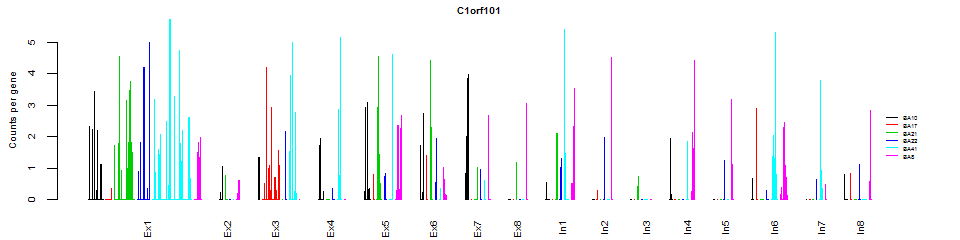

### This is life looks like:

**What's our life**:

Example of usage on R markdown, rpubs, github and LabNotes wiki
---------------------------------------------------------------

**rpubs**: <https://rpubs.com/>

**github**: <https://github.com/>

**wiki**:<http://genome-tech.ucsd.edu/LabNotes/index.php/Shicheng_Guo>

Useful Script: **R markdown cheat sheet**
<https://www.rstudio.com/wp-content/uploads/2015/02/rmarkdown-cheatsheet.pdf>

\*\* R markdown slides\*\* <http://rpubs.com/mansun_kuo/24330>

R -e 'library("rmarkdown");

library("knitr");

rmarkdown::render("NormalDevconJuly.Rmd")'

R -e 'library("markdown");

rpubsUpload("normalDev","NormalDevconJuly.html")'

library("knitr")

library("rmarkdown")

rmarkdown::render('DeconvolutionMixture.Rmd')

pandoc("DeconvolutionMixture.md",format="MediaWiki")

Example 1
---------

Here, I want to show how to use **R markdown**, **rpubs**, **github**
and **LabNotes wiki** to Kun's lab member. I just use the bar plot
example which I created yesterday for Blue. Blue told me he want to
build a figure for his future manuscript, just like this one:

    knitr::include_graphics("C:\\Users\\shicheng\\Documents\\GitHub\\Lab\\Cn39rtdUIAAi8n7.png")

Here is my code:

    setwd("C:\\Users\\shicheng\\Documents\\GitHub\\Lab")

    barplotReAxis<-function(mp){
      mp<-c(0,mp)
      np<-c()
      end<-length(mp)-1
      for(i in 1:end){
        np.tmp<-(mp[i]+mp[i+1])/2
        np<-c(np,np.tmp)
      }
      np<-round(np)
      names(np)=names(mp)[2:length(mp)]
      return(np)
    }

    nbt.data<-data.matrix(read.table("BrainRNASeqBlue.txt",head=T,row.names=1,sep="\t",as.is=T))

    nbt.data[1:5,1:5]

    ##       In1BA8_20131219_1C50 In1BA8_20131219_1C92 In1BA8_20140123_1C82_S168
    ## TTC8              0.000000             1.996332                 0.0000000
    ## SAT1              2.008214             3.059552                 0.5647455
    ## GDPD2             0.000000             0.000000                 0.0000000
    ## NEMF              3.848529             1.046266                 1.6185959
    ## ZNF22             0.000000             0.000000                 0.0000000
    ##       In1BA8_20140123_1C90_S178 In1BA8_20140205_1C39_S75
    ## TTC8                  0.0000000                 0.000000
    ## SAT1                  0.3191807                 5.030771
    ## GDPD2                 0.0000000                 0.000000
    ## NEMF                  0.8398416                 4.180966
    ## ZNF22                 3.4542009                 0.000000

    i=6
    rmpk<-nbt.data[i,]
    genename<-rownames(nbt.data)[i]
    genename

    ## [1] "C1orf101"

    cell.labels <- substr(names(rmpk),0,7)
    cell.labels<-unlist(lapply(cell.labels,function(x) unlist(strsplit(x,"_"))[1]))
    level=c(paste("In",1:8,sep=""),paste("Ex",1:8,sep=""))
    group1<-factor(unlist(lapply(cell.labels,function(x) substr(x,1,3))))
    group2<-factor(unlist(lapply(cell.labels,function(x) substr(x,4,nchar(x)))))
    group3<-1:length(group2)
    df<-data.frame(rmpk,cell.labels,group1,group2,group3)
    df<-df[order(df$cell.labels),]
    head(df)

    ##                                rmpk cell.labels group1 group2 group3
    ## Ex1BA10_20140827A_1C03_S1  0.000000     Ex1BA10    Ex1   BA10   1058
    ## Ex1BA10_20140827A_1C23_S42 0.000000     Ex1BA10    Ex1   BA10   1059
    ## Ex1BA10_20140827A_1C25_S27 0.000000     Ex1BA10    Ex1   BA10   1060
    ## Ex1BA10_20140827A_1C32_S2  0.000000     Ex1BA10    Ex1   BA10   1061
    ## Ex1BA10_20140827A_1C37_S33 0.000000     Ex1BA10    Ex1   BA10   1062
    ## Ex1BA10_20140827A_1C50_S3  2.315699     Ex1BA10    Ex1   BA10   1063

**Now we are going to focusn on gene: C1orf101**

Okay, the above code is use to collect the data frame. Now, let's do the
bar plot.

    filename=paste(genename,".png",sep="")
    size=0.6
    # png(filename,width = 8, height = 2, units = 'in', res = 300)
    par(mar=c(2, 3, 1, 3), xpd=TRUE)
    space<-rep(0,nrow(df))
    space[cumsum(table(df$cell.labels))+1]<-30
    space[cumsum(table(df$group1))+1]<-200
    space<-space[1:(length(space)-1)]
    bar.positions <- barplot(df$rmpk,border=df$group2,xaxt='n',space=space,main=genename,cex.main=0.6,cex.lab=size,cex.axis=size)
    title(ylab = "Counts per gene", cex.lab = size,line = 2)
    label<-levels(df$group1)
    table(df$group1)

    ## 
    ##  Ex1  Ex2  Ex3  Ex4  Ex5  Ex6  Ex7  Ex8  In1  In2  In3  In4  In5  In6  In7 
    ## 1058   96  299  174  250  139  115   47  160   55   71  121   62  239   62 
    ##  In8 
    ##  135

    pos<-bar.positions[cumsum(barplotReAxis(table(df$group1)))]
    axis(side=1,at=pos,labels=label,tick=FALSE,las=2,cex.axis=size)
    legend(x=max(bar.positions)+100,y=max(rmpk)/2,legend=levels(df$group2),bty="n",lty=1,bg="transparent",col=c(as.numeric(unique(df$group2))),cex=0.4,inset=c(-0.2,0))

    # dev.off()
